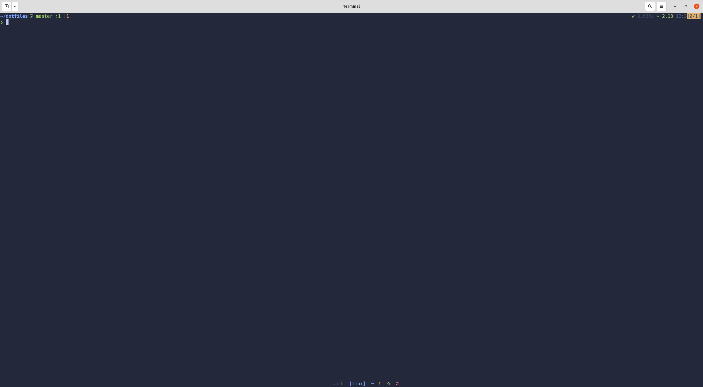
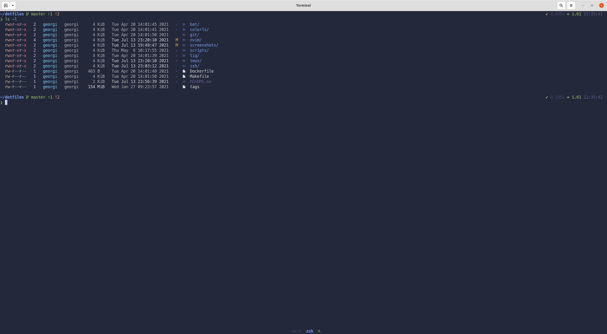
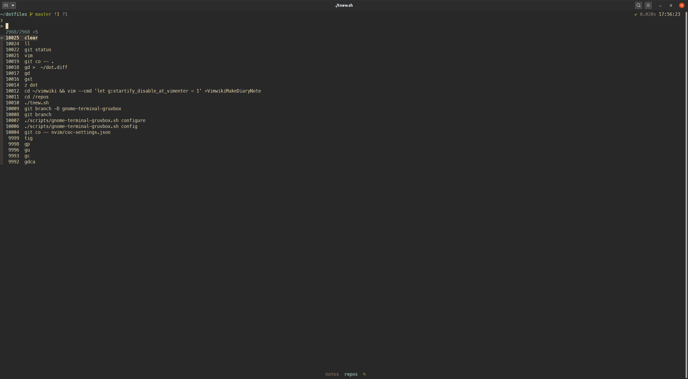
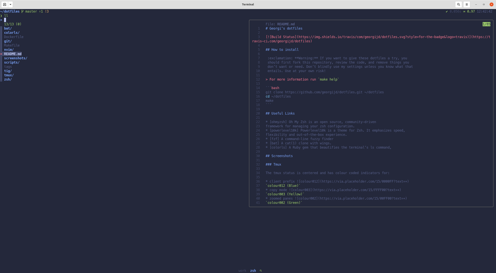
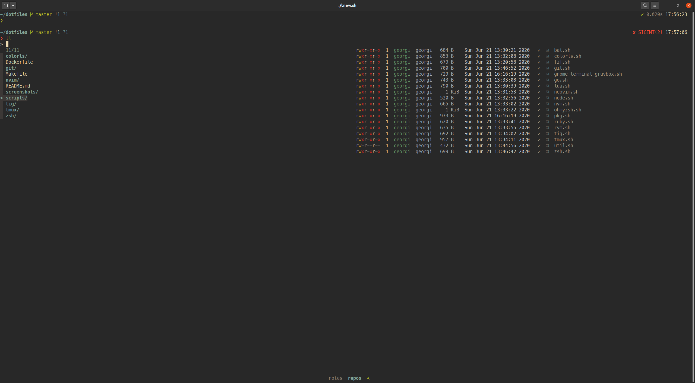
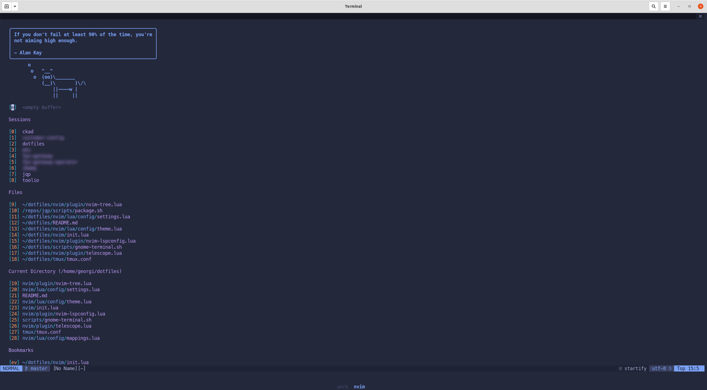
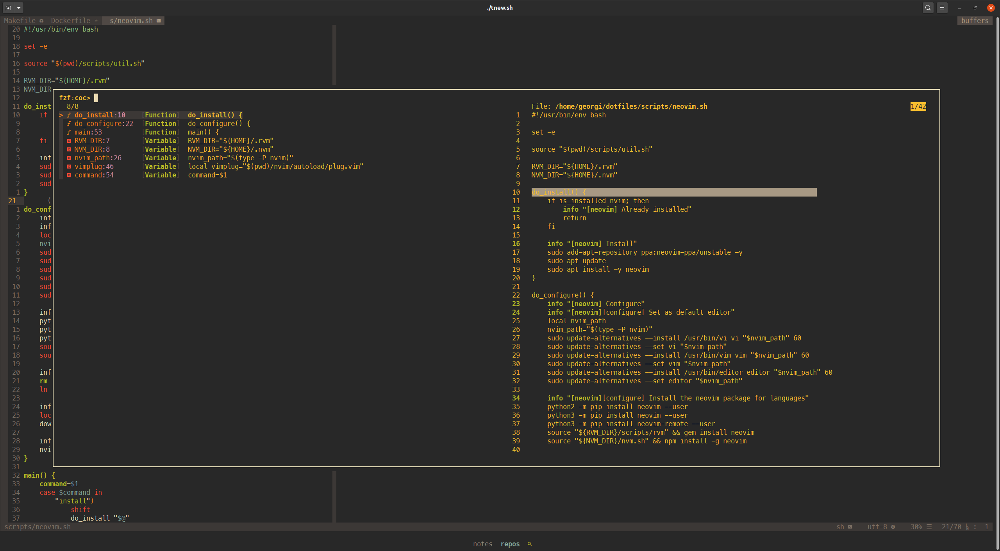
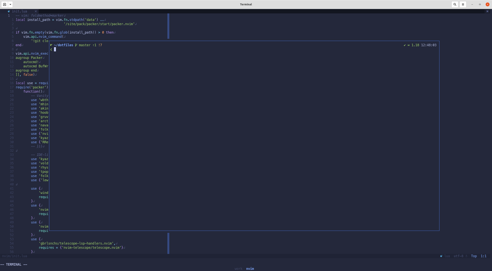

# Georgi's dotfiles

[](https://travis-ci.com/georgijd/dotfiles)

## How to install

 :exclamation: **Warning:** If you want to give these dotfiles a try, you
 should first fork this repository, review the code, and remove things you
 don’t want or need. Don’t blindly use my settings unless you know what that
 entails. Use at your own risk!

> For more information run `make help`

```bash
git clone https://github.com/georgijd/dotfiles.git ~/dotfiles
cd ~/dotfiles
make
```

## Useful Links

* [onedark] A dark Vim/Neovim color scheme inspired by Atom's One Dark syntax theme.
* [ohmyzsh] Oh My Zsh is an open source, community-driven
framework for managing your zsh configuration.
* [powerlevel10k] Powerlevel10k is a theme for Zsh. It emphasizes speed,
flexibility and out-of-the-box experience.
* [fzf] A command-line fuzzy finder
protocol support as VSCode
* [bat] A cat(1) clone with wings.
* [colorls] A Ruby gem that beautifies the terminal's ls command,

## Screenshots

### Tmux

The tmux status is centered and has colour coded indicators for:

* client prefix 
`colour012 (Blue)`
* copy mode 
`colour003 (Yellow)`
* zoomed panes 
`colour002 (Green)`
* synchronized panes 
`colour001 (Red)`



### Shell

#### List directory contents and show git status for each entry with [colorls]



#### Command history search with [fzf]



#### Autocompletion file preview with [fzf] and [bat]



#### Autocompletion directory preview with [fzf] and [colorls]



#### Neovim

#### Session management with [vim-startify]



#### LSP symbols and tags with [fzf.vim] and [vista.vim]



#### Terminal with [vim-floaterm]



### And much more

[bat]: https://github.com/sharkdp/bat "Bat"
[colorls]: https://github.com/athityakumar/colorls "Colorls"
[fzf.vim]: https://github.com/junegunn/fzf.vim "FZF Vim"
[fzf]: https://github.com/junegunn/fzf "FZF"
[onedark]: https://github.com/navarasu/onedark.nvim "OneDark"
[ohmyzsh]: https://github.com/ohmyzsh/ohmyzsh "Oh My Zsh"
[powerlevel10k]: https://github.com/romkatv/powerlevel10k "Powerlevel10k"
[vim-floaterm]: https://github.com/voldikss/vim-floaterm "VIM Floaterm"
[vim-startify]: https://github.com/mhinz/vim-startify "VIM Startify"
[vista.vim]: https://github.com/liuchengxu/vista.vim "Vista Vim"
