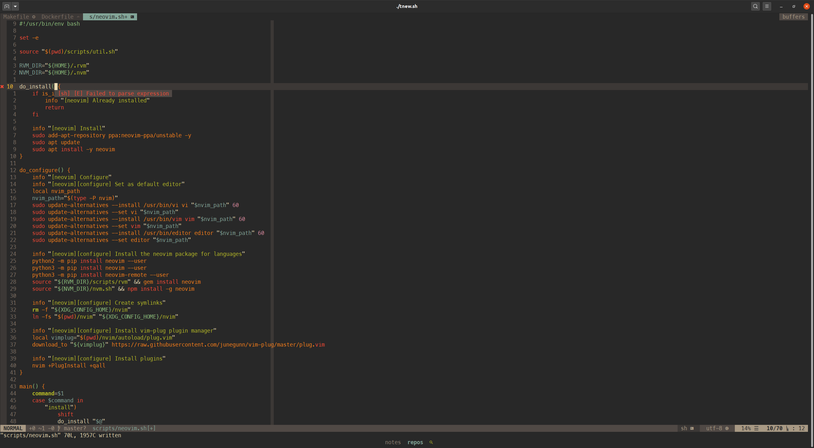
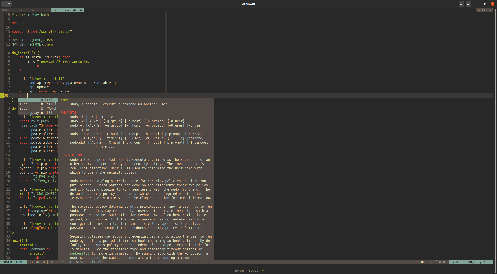
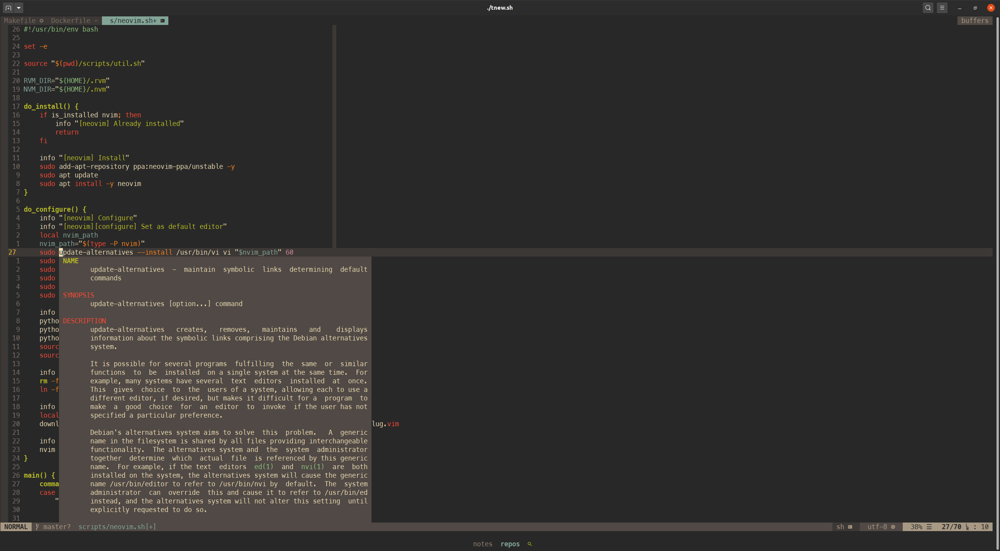
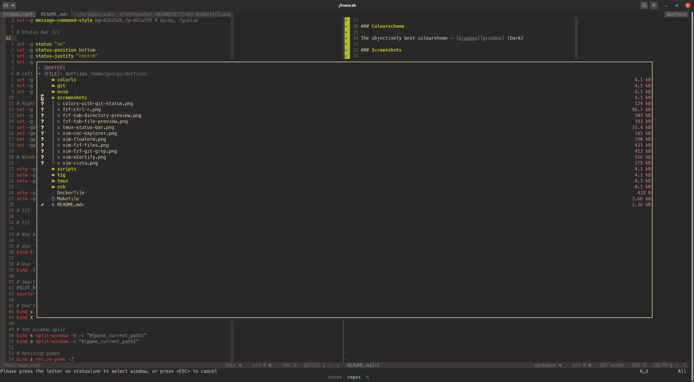
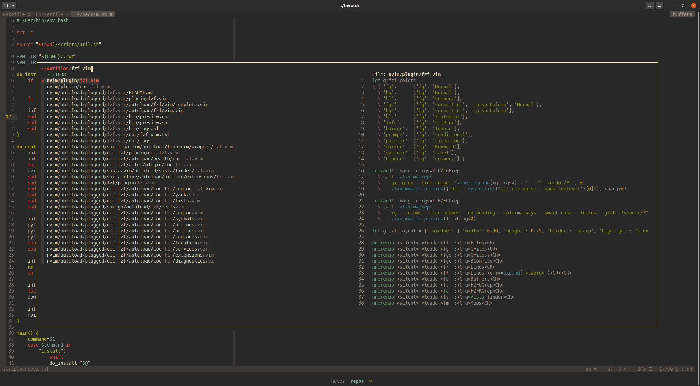
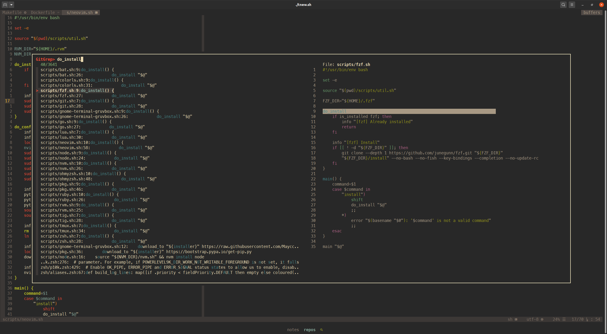

# Georgi's dotfiles

[](https://travis-ci.com/georgijd/dotfiles)

## How to install

 :exclamation: **Warning:** If you want to give these dotfiles a try, you
 should first fork this repository, review the code, and remove things you
 don’t want or need. Don’t blindly use my settings unless you know what that
 entails. Use at your own risk!

> For more information run `make help`

```bash
git clone https://github.com/georgijd/dotfiles.git ~/dotfiles
cd ~/dotfiles
make
```

## Useful Links

* [gruvbox] Retro groove color scheme for Vim.
* [ohmyzsh] Oh My Zsh is an open source, community-driven
framework for managing your zsh configuration.
* [powerlevel10k] Powerlevel10k is a theme for Zsh. It emphasizes speed,
flexibility and out-of-the-box experience.
* [fzf] A command-line fuzzy finder
* [coc.nvim] Intellisense engine for Vim8 & Neovim, full language server
protocol support as VSCode
* [bat] A cat(1) clone with wings.
* [colorls] A Ruby gem that beautifies the terminal's ls command,

## Screenshots

### Tmux

The tmux status is centered with colour coded indicators for:

* client prefix  `#83a598`
* copy mode  `#fabd2f`
* zoomed panes  `#b8bb26`
* synchronized panes  `#fb4934`


### Shell

#### List directory contents with [colorls] including git status


#### Command history search with [fzf]


#### Autocompletion file preview [fzf] and [bat]


#### Autocompletion directory preview [fzf] and [colorls]


#### Neovim

#### Session management with [vim-startify]


#### LSP diagnostics with [coc.nvim]



#### Autocompletion with [coc.nvim]



#### Symbol Documentation with [coc.nvim]



#### LSP symbols and tags with [fzf.vim] and [vista.vim]


#### File explorer with [coc.nvim] and [coc-explorer]



#### Terminal with [vim-floaterm]


#### File fuzzy search with [fzf.vim]



#### Git grep with [fzf.vim]



### And much more

[bat]: https://github.com/sharkdp/bat "Bat"
[coc-explorer]: https://github.com/weirongxu/coc-explorer "Coc Explorer"
[coc.nvim]: https://github.com/neoclide/coc.nvim "Conquer of Completion"
[colorls]: https://github.com/athityakumar/colorls "Colorls"
[fzf.vim]: https://github.com/junegunn/fzf.vim "FZF Vim"
[fzf]: https://github.com/junegunn/fzf "FZF"
[gruvbox]: https://github.com/morhetz/gruvbox "Gruvbox"
[ohmyzsh]: https://github.com/ohmyzsh/ohmyzsh "Oh My Zsh"
[powerlevel10k]: https://github.com/romkatv/powerlevel10k "Powerlevel10k"
[tmux-copycat]: https://github.com/tmux-plugins/tmux-copycat "Tmux copycat"
[tmux-open]: https://github.com/tmux-plugins/tmux-open "Tmux open"
[tmux-sensible]: https://github.com/tmux-plugins/tmux-sensible "Tmux sensible"
[tmux-yank]: https://github.com/tmux-plugins/tmux-yank "Tmux yank"
[tpm]: https://github.com/tmux-plugins/tpm "Tmux Plugin Manager"
[vim-floaterm]: https://github.com/voldikss/vim-floaterm "VIM Floaterm"
[vim-startify]: https://github.com/mhinz/vim-startify "VIM Startify"
[vista.vim]: https://github.com/liuchengxu/vista.vim "Vista Vim"
